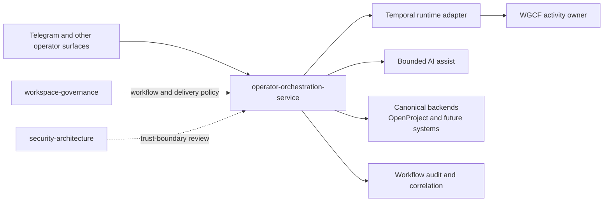

# operator-orchestration-service

`operator-orchestration-service` is a shared operator-facing workflow service that brokers bounded operator requests from fast interaction surfaces into governed, auditable workflow actions against canonical backend systems.

Current maturity:

- lifecycle: active
- workspace status: active repo and active shared component
- primary initial use case: idea capture and operator-authored idea triage from
  Telegram into OpenProject
- current implementation scope: workflow-catalog plus bounded capture, triage,
  decision, internal evaluation metadata, broker-owned proposal consumption and
  closeout, broker-owned delivery execution reads and writes against the
  separate OpenProject delivery ART project, and source-complete governed Work
  Design assist/apply routes behind an inactive model profile
- durable orchestration posture: versioned OOS definition and aggregate run
  boundary implemented, with normal Temporal execution disabled pending
  activation; a separate permit-bound commissioning proof surface is
  source-complete but remains disabled pending the Platform executor and exact
  controlled-proof authorization
- local fast-iteration lanes:
  - `dev-integration` `idea-workflow` profile on local `k3s`
  - `dev-integration` `accepted-idea-delivery` profile on local `k3s`

## Architecture At A Glance



This service is the shared workflow seam between fast operator surfaces and
durable backend systems. It should stay bounded and workflow-shaped rather than
becoming a generic backend proxy.

## Repo Shape

Use the repo by path role, not by guesswork:

- `src/`
  - active runtime implementation
  - bounded workflow APIs, adapters, audit, and workflow catalog behavior
- `src/agent-action/`
  - shared internal enforcement for canonical agent-action requests, WGCF
    decisions, owner dispatch boundaries, and terminal OOS action receipts
- `docs/contracts/`
  - durable API and adapter contracts
- `docs/architecture/`
  - architecture and runtime guidance
- `dev-integration/profiles/`
  - supported fast local runtime shapes for broker-owned workflow rehearsal
- `scripts/`
  - repo-local validation utilities
  - these are support tooling, not operator workflow entrypoints

If a future session finds an ad hoc helper outside those roles, treat it as
suspect until it is documented or removed.

## Intended Role

This service exists to keep workflow orchestration out of fast-changing channel
adapters such as `openclaw-telegram-enhanced/`.

The service should provide:

- stable internal workflow APIs
- workflow correlation and audit
- bounded AI-assist orchestration for operator workflows
- adapters to canonical systems such as OpenProject
- explicit operator approval before durable workflow outcomes are committed
- versioned durable definitions, aggregate run projections, and final
  orchestration receipts when a workflow qualifies for durable execution

## System Position

The intended path is:

`Telegram or another operator surface -> operator-orchestration-service -> AI assist backend and canonical backend system`

Initial target flow:

`/idea` or `/idea triage` in Telegram -> `operator-orchestration-service` ->
OpenProject write, with a reserved future AI-assisted discuss path kept behind
the broker

## What This Repo Owns

- workflow-oriented service APIs such as idea capture, triage, and decision
  recording
- correlation ids, idempotency handling, duplicate-write suppression for
  bounded ART closeout replay, and workflow audit events
- provider-agnostic AI assist invocation for bounded operator workflows
- receipt-bound Work Design context/tree advice and operator-approved canonical
  plan application
- OpenProject-facing workflow adapters
- operator approval handling at the workflow layer
- durable workflow definition and run control behind a replaceable Temporal
  adapter

## What This Repo Does Not Own

- Telegram delivery, message formatting, or chat UX
- workspace admission contracts or intake policy
- platform rollout authority
- provider-specific governed AI policy
- canonical product or component records outside the workflows it brokers

## First Capability Boundary

The first supported workflow is expected to be:

- capture an idea from Telegram
- optionally record operator-authored triage for that idea without requiring
  desktop Codex access
- record a first bounded durable outcome as `parked`, `accepted`, or `rejected`
- record internal evaluation metadata using workspace-derived canonical tokens
  plus full free-text notes for later AI-assisted owner and scope population
- reserve bounded AI-assisted triage discussion for a later workflow step
- leave `owner-assigned` for a later explicit owner-vocabulary slice

## Security And Governance Posture

This service crosses multiple trust boundaries and must not become the trust
anchor for governance decisions.

Non-negotiable rules:

- operator approval remains required for durable intake decisions
- model output must stay bounded to a reviewed structured schema
- the service must not mutate active workspace contracts directly
- Telegram or other channel adapters must not carry backend or model-provider
  credentials

The service is active as a bounded shared workflow component now, but its live
scope is still intentionally narrow.

## Initial Repo Guide

- repo-local guidance: [AGENTS.md](AGENTS.md)
- architecture: [docs/architecture/overview.md](docs/architecture/overview.md)
- runtime shape: [docs/architecture/runtime-shape.md](docs/architecture/runtime-shape.md)
- delivery operator surface:
  [docs/operations/delivery-workflow-operator-surface.md](docs/operations/delivery-workflow-operator-surface.md)
- agent-action enforcement surface:
  [docs/operations/agent-action-enforcement.md](docs/operations/agent-action-enforcement.md)
- API reference front: [docs/api/README.md](docs/api/README.md)
- fast API contract lookup:
  `npm run api:contract -- <METHOD> <PATH>`
- live API contract probe:
  `npm run api:probe -- <METHOD> <PATH>`
- preferred local ART CLI:
  `npm run art -- bootstrap`
  or `npm run art -- workflow-health`
  then extend into bounded initiative commands like
  `npm run art -- initiative planning-repair <delivery-id> <payload.json>`
  or local closeout scaffolding like
  `npm run art -- scaffold initiative-close <delivery-id> <output.json> [repo-root...]`
- managed ART drafts and Review Packets:
  `npm run art -- draft create <operation> <target-id-or-dash> .art/drafts/<name>.json`
  and
  `npm run art -- review-packet draft <delivery-id> .art/review-packets/<name>.json <work-item-id...>`
  followed for schema-v2 finalization by
  `npm run art -- review-packet operating-readiness <packet.json> <receipt.json>`
- WGCF receipt handoff into managed drafts:
  `npm run art -- wgcf draft .art/wgcf/<name>.json .art/drafts/<name>.json`
- automatic WGCF ART readiness on the normal local ART path:
  `npm run art -- item continuation <work-item-id>` includes
  `wgcf_art_readiness`, while `npm run art -- item complete <work-item-id>
  <payload.json>` and `npm run art -- item stale-open-close <work-item-id>
  <payload.json>` fail closed before broker mutation when WGCF readiness blocks
- optimized compact ART packets:
  `npm run art -- initiative active-session <delivery-id>`,
  `npm run art -- initiative evidence-packet <delivery-id>`,
  `npm run art -- item evidence-packet <work-item-id>`, and
  `npm run art -- review-packet evidence-packet <packet.json>`
- landing-unit closeout from finalized Review Packet coverage:
  `npm run art -- landing-unit status <packet.json>`,
  `npm run art -- landing-unit dry-run <packet.json>`, and
  `npm run art -- landing-unit submit <packet.json>`
- resumable Delivery ART source lifecycle:
  `npm run art -- work start|status|continue|close <work-item-id>` owns
  persistent reconstructable coordination, authors canonical work-start and
  schema-v2 Review Packet artifacts, and returns one exact next action at each
  source, approval, merge, Security, or ART-closeout gate
- default CGG packet projection for large CLI output:
  large compact ART output writes the full broker response under
  `.art/outputs` and adds `cgg_packet_ref` by default; oversized `--json`
  output is suppressed into the artifact plus packet reference instead of
  raw-printing to the agent context. Projection sync subprocess stdout/stderr
  is also captured into `.art/outputs` and packetized instead of being streamed
  raw. Use `ART_CGG_PACKETING=off` only for explicit local debugging, or
  `ART_CGG_PACKETING=required` to fail closed when CGG projection is unavailable.
- required WGCF ART readiness in the active dev-integration broker profile:
  `WGCF_ART_READINESS_MODE=required` makes server-side completion and stale-open
  closeout routes call the WGCF API before OpenProject writes
- pre-merge landing-unit readiness:
  `npm run art -- review-packet readiness .art/review-packets/<name>.json`
  after the source PR is open and before it is merged; each packet covers one
  owner repo and must match the exact clean local head, pushed branch, and live
  open GitHub PR head
- completion-evidence preflight:
  `npm run validate:completion-evidence -- <payload.json>`
- assignable-principal preflight for `assignee_login` / `responsible_login`:
  `k3s kubectl -n <active-devint-namespace> exec deploy/operator-orchestration-service -- node scripts/show_delivery_art_assignables.mjs`
- done-state narrative rule:
  completed work-item descriptions must keep the required narrative headings and
  a flat `Execution Context` that matches the stored owner, parent, delivery
  team, and iteration fields
- final-body closeout rule:
  broker-added completion or work notes must stay inside `Operator work notes`,
  and the broker revalidates the final stored body before patching a done item
- delivery workflow API boundary:
  [docs/architecture/delivery-workflow-api-boundary.md](docs/architecture/delivery-workflow-api-boundary.md)
- security model: [docs/architecture/security-model.md](docs/architecture/security-model.md)
- interface contract: [contracts/interface-manifest.json](contracts/interface-manifest.json)
- initial API shape: [docs/contracts/intake-api-v1.md](docs/contracts/intake-api-v1.md)
- graduated Console Proposal boundary:
  [docs/contracts/proposal-workflow-v1.md](docs/contracts/proposal-workflow-v1.md)
- source-neutral Delivery ingress contract:
  [docs/contracts/delivery-ingress-v1.md](docs/contracts/delivery-ingress-v1.md)
- governed Delivery Work Design contract:
  [docs/contracts/work-design-v1.md](docs/contracts/work-design-v1.md)
- Prototype Delivery application operator surface:
  [docs/operations/prototype-delivery-application.md](docs/operations/prototype-delivery-application.md)
- Proposal workflow operator surface:
  [docs/operations/proposal-workflow-operator-surface.md](docs/operations/proposal-workflow-operator-surface.md)
- accepted-idea delivery consumption contract:
  [docs/contracts/accepted-idea-delivery-consumption-v1.md](docs/contracts/accepted-idea-delivery-consumption-v1.md)
- delivery workflow API contract:
  [docs/contracts/delivery-workflow-api-v1.md](docs/contracts/delivery-workflow-api-v1.md)
- durable orchestration contract:
  [docs/contracts/durable-orchestration-v1.md](docs/contracts/durable-orchestration-v1.md)
- durable orchestration operator surface:
  [docs/operations/durable-orchestration-operator-surface.md](docs/operations/durable-orchestration-operator-surface.md)
- WGCF ART handoff contract:
  [docs/contracts/wgcf-art-handoff-v1.md](docs/contracts/wgcf-art-handoff-v1.md)
- OpenProject adapter contract:
  [docs/contracts/openproject-adapter-v1.md](docs/contracts/openproject-adapter-v1.md)
- audit event contract: [docs/contracts/audit-events-v1.md](docs/contracts/audit-events-v1.md)
- change-record lane: [docs/records/change-records/README.md](docs/records/change-records/README.md)
- dev-integration profile:
  [dev-integration/profiles/idea-workflow/README.md](dev-integration/profiles/idea-workflow/README.md)
- accepted-idea-delivery profile:
  [dev-integration/profiles/accepted-idea-delivery/README.md](dev-integration/profiles/accepted-idea-delivery/README.md)
- runtime-admission security review:
  [`security-architecture/docs/reviews/components/2026-04-18-operator-orchestration-service-runtime-admission.md`](https://github.com/mfshaf7/security-architecture/blob/main/docs/reviews/components/2026-04-18-operator-orchestration-service-runtime-admission.md)
- component security view:
  [`security-architecture/docs/architecture/components/operator-orchestration-service/README.md`](https://github.com/mfshaf7/security-architecture/blob/main/docs/architecture/components/operator-orchestration-service/README.md)
- security review checklist:
  [`security-architecture/docs/reviews/security-review-checklist.md`](https://github.com/mfshaf7/security-architecture/blob/main/docs/reviews/security-review-checklist.md)
- AI governance standard:
  [`security-architecture/docs/standards/ai-security-and-governance.md`](https://github.com/mfshaf7/security-architecture/blob/main/docs/standards/ai-security-and-governance.md)

## Runtime

The repo carries a Node API runtime plus a separate OOS workflow-worker image
target. Exact dependencies are locked in `package-lock.json`.

Implemented in the current phase:

- `GET /healthz`
- `GET /readyz`
- `GET /version`
- `GET /v1/workflows`
- `GET /v1/workflows/idea-command`
- `GET /v1/workflows/idea-capture`
- `GET /v1/workflows/idea-triage`
- `GET /v1/orchestration/definitions`
- `GET /v1/orchestration/definitions/{definition_id}`
- `GET /v1/orchestration/runs`
- `POST /v1/orchestration/runs`
- `GET /v1/orchestration/runs/{run_id}`
- `POST /v1/orchestration/runs/{run_id}/controls`
- `POST /v1/orchestration/controlled-proof/executions`
- `GET /v1/orchestration/controlled-proof/executions/{run_id}`
- `POST /v1/orchestration/controlled-proof/executions/{run_id}/controls`

The definition catalog is readable before activation. Run start, controls, and
worker execution remain denied until the Platform and Security activation
gates carry real accepted references. Once admitted, a new run start returns a
worker-independent receipt with its stable run id; aggregate state is read from
the run resource. The controlled-proof routes are a separate internal surface
for the authenticated `platform-controlled-proof-executor`. They consume one
digest-pinned commissioning context, do not use the normal activation-generation
registry, do not activate the profile, and cannot start an execution outside
the exact authorized session and OOS receipt-owner subset. Externally observed
restart, replay, duplicate-suppression, and restore scenarios remain waiting
until the Platform executor supplies bounded artifact evidence through the
existing signal control.
- `GET /v1/workflows/idea-decision`
- `GET /v1/ideas`
- `GET /v1/ideas/{idea_id}`
- `POST /v1/ideas/lookup`
- `POST /v1/ideas/capture`
- `POST /v1/ideas/{idea_id}/triage`
- `POST /v1/ideas/{idea_id}/decision`
- `POST /v1/ideas/{idea_id}/consume`
- `POST /v1/ideas/{idea_id}/closeout`
- `POST /v1/ideas/{idea_id}/evaluation`
- `GET /v1/delivery-initiatives`
- `GET /v1/delivery-initiatives/{delivery_id}/execution-summary`
- `GET /v1/delivery-initiatives/{delivery_id}/planning`
- `GET /v1/delivery-initiatives/{delivery_id}/pi-objectives`
- `GET /v1/delivery-initiatives/{delivery_id}/closeout-readiness`
- `GET /v1/delivery-session/bootstrap`
- `GET /v1/delivery-session/workflow-health`
- `GET /v1/delivery-session/quality-pack`
- `POST /v1/delivery-art/mutation-drafts`
- `POST /v1/delivery-art/mutation-drafts/validate`
- `GET /v1/delivery-art/lifecycle/capabilities`
- `POST /v1/delivery-art/work-start/draft`
- `POST /v1/delivery-art/review-packets`
- `POST /v1/delivery-art/review-packets/finalization-drafts`
- `POST /v1/delivery-art/review-packets/validate`
- `POST /v1/delivery-art/review-packets/readiness`
- `POST /v1/delivery-art/review-packets/prepare-finalization`
- `POST /v1/delivery-art/review-packets/operating-readiness`
- `POST /v1/delivery-art/review-packets/finalize`
- `GET /v1/delivery-work-items/{work_item_id}/continuation-context`
- `POST /v1/delivery-initiatives/{delivery_id}/governance`
- `POST /v1/delivery-initiatives/{delivery_id}/plan/apply`
- `POST /v1/delivery-initiatives/{delivery_id}/plan/repair`
- `POST /v1/delivery-initiatives/{delivery_id}/system-demo`
- `POST /v1/delivery-initiatives/{delivery_id}/inspect-and-adapt`
- `POST /v1/delivery-initiatives/{delivery_id}/pi-review`
- `POST /v1/delivery-initiatives/{delivery_id}/close`
- `POST /v1/delivery-work-items`
- `POST /v1/delivery-work-items/bulk-update`
- `POST /v1/delivery-work-items/{work_item_id}/blocker`
- `POST /v1/delivery-work-items/{work_item_id}/dependency`
- `POST /v1/delivery-work-items/{work_item_id}/parking`
- `POST /v1/delivery-work-items/{work_item_id}/update`
- `POST /v1/delivery-work-items/{work_item_id}/move`
- `POST /v1/delivery-work-items/{work_item_id}/complete`
- `POST /v1/delivery-work-items/{work_item_id}/stale-open-close`

Deferred to the next phase:

- AI-assisted `/idea triage discuss <idea-id>` suggestion path
- `owner-assigned` with an explicit owner vocabulary
- archive visibility metadata for terminal idea records only
- runtime admission and Vault-delivered secret wiring

`POST /v1/ideas/{idea_id}/evaluation` is intentionally internal metadata, not a
Telegram operator command. It exists so later AI-assisted evaluation can write
system-vocabulary owner and scope suggestions plus full notes without changing
the operator command surface first.

`POST /v1/ideas/{idea_id}/consume` is also internal-only. It promotes an
already accepted proposal into the separate OpenProject delivery ART project,
creates the delivery record if needed, and preserves durable backlinks in both
directions without adding a Telegram command surface.

Delivery execution is now broker-owned end to end. `platform-engineering`
continues to own OpenProject runtime, bootstrap, access, identity, board/view
projection repair, and one-time ART normalization, but it is no longer the
supported execution surface for ART reads or mutations.

`POST /v1/ideas/{idea_id}/closeout` is internal-only as well. It verifies the
linked delivery record is actually `done`, then moves the source proposal to
`implemented` while keeping the proposal-to-delivery backlink intact.

`GET /v1/delivery-initiatives/{delivery_id}/execution-summary` is the first
delivery-plane read model owned directly by the broker. It returns a bounded
execution summary for one delivery initiative without exposing raw OpenProject
query semantics to callers.

`POST /v1/delivery-initiatives/{delivery_id}/governance` is the bounded
initiative governance update surface. It is initiative-only and accepts only
the delivery Epic fields that carry PM² or initiative meaning:

- `status`
- `target_pi`
- `initiative_family`
- `lineage_role`
- `architecture_anchor_ref`
- `required_upstream_ref`
- `pm2_phase`
- `sponsor`
- `business_objective`
- `success_criteria`
- `system_demo_evidence`
- `inspect_and_adapt_actions`
- `nfr_category`
- `description`

`POST /v1/delivery-initiatives/{delivery_id}/plan/apply` is the bounded plan
reconciliation surface. It reuses or updates existing child nodes by
parent/type/subject, validates readiness before publishing `ready` items, and
preserves the reconcile modes already used in live proof:

- `reconcile_missing=ignore|park`
- `reconcile_decision=retire|defer`
- `reconcile_reason`
- `reconcile_retirement_reason`

`POST /v1/delivery-initiatives/{delivery_id}/plan/repair` is the bounded
planning-repair surface. It keeps retarget, decommit, and execution-posture
correction inside one initiative-scoped broker workflow instead of scattering
those decisions across ad hoc per-item update writes.

`GET /v1/delivery-session/workflow-health` is the fast operator health read for
the active ART lane. It surfaces roadmap projection drift, PM² projection
drift, and the broker-compatible OpenProject view model from one route before a
session falls back to lower-level quality debugging.

`GET /v1/delivery-session/quality-pack` is the broker-native portfolio payload
used by the platform ART quality checker. It exposes the same minimal project
work-package data the platform quality gate needs without dropping back to
direct OpenProject Rails runners in normal quality/readiness execution.

`npm run art -- ...` is now the preferred normal-session operator entrypoint
for the active devint ART lane. It wraps the broker bootstrap read, bounded
initiative and work-item reads, planning repair, and closeout write commands
without requiring raw `kubectl exec ... node -e ...` one-liners in routine
use.

Read-heavy ART CLI commands print compact summaries by default. Add `--json`
to print the complete broker response when needed. When a compacted command
would otherwise emit a large full response, the CLI writes it under
`.art/outputs/` and prints that path.

That same entrypoint now includes initiative-lineage governance writes:

- `npm run art -- initiative governance <delivery-id> <payload.json>`

Use it to set or repair top-level Epic lineage metadata through the broker
instead of editing OpenProject fields manually.

That same entrypoint now also scaffolds editable closeout payloads for item
completion and initiative closeout:

- `npm run art -- scaffold item-complete <work-item-id> <output.json> [repo-root...]`
- `npm run art -- scaffold initiative-close <delivery-id> <output.json> [repo-root...]`

Those scaffold commands stay local. They inspect the supplied repo roots,
collect changed surfaces plus branch or commit linkage, and emit a valid JSON
starting point for ART closeout evidence instead of forcing the operator to
assemble every section by hand.

For planned ART writes and source-backed closeout, use managed artifacts
instead of loose `.tmp` payload files:

- `npm run art -- draft operations`
- `npm run art -- draft create <operation> <target-id-or-dash> .art/drafts/<name>.json`
- `npm run art -- draft validate .art/drafts/<name>.json`
- `npm run art -- draft submit .art/drafts/<name>.json`
- `npm run art -- review-packet draft <delivery-id> .art/review-packets/<name>.json <work-item-id...>`
- `npm run art -- review-packet validate .art/review-packets/<name>.json`
- `npm run art -- review-packet finalize .art/review-packets/<name>.json`
- `npm run art -- landing-unit status .art/review-packets/<name>.json`
- `npm run art -- landing-unit dry-run .art/review-packets/<name>.json`
- `npm run art -- landing-unit submit .art/review-packets/<name>.json`
- `npm run art -- work start <work-item-id>`
- `npm run art -- work status <work-item-id>`
- `npm run art -- work continue <work-item-id>`
- `npm run art -- work close <work-item-id>`
- `npm run art -- scratch status`

The normal source-backed Delivery ART path is the work-session command family,
not manual lifecycle-plan or Review Packet assembly:

- start from one work item and complete the generated Landing Unit decision
  when required
- inspect without mutation with `work status`
- advance eligible mechanics with `work continue`
- complete the reported source work, evidence, pull-request, Security, merge,
  exception, or ART-closeout gate, then rerun the exact returned command
- use `work close` as the explicit operator closeout decision
- after activation item `#970` closes, let that same command retire only
  manifest-proven session-created Git and allowlisted managed state; ambiguous
  or pre-existing resources are retained and partial failure resumes from
  `cleanup-blocked`

External atomic session state keeps the Landing Unit identity, owner repo,
branch plan, rollback boundary, covered ART ids, and stable artifact names. It
stores no secrets or absolute worktree paths. ART, Git, WGCF, and Review
Packets remain canonical. Reconciliation is idempotent and stops at human
authority boundaries.

After a Review Packet is finalized, work status reads source, pull-request, and
merge truth from that immutable packet. Process restart, context compaction,
branch cleanup, or worktree relocation must not downgrade the projection.

The governed Delivery ART custody path is separate from the schema-v1 local
draft compatibility path. The work-session commands own normal orchestration over
these canonical lower-level operations:

- `npm run art -- artifact validate <artifact.json>`
- `npm run art -- artifact resolve <artifact.json>`
- `npm run art -- architecture persist <artifact.json>`
- `npm run art -- work-start evaluate <artifact.json>`
- `npm run art -- review-packet readiness <packet.json>`
- `npm run art -- review-packet prepare-finalization <packet.json>`
- `npm run art -- review-packet operating-readiness <packet.json> <receipt.json>`
- `npm run art -- review-packet finalize <packet.json> --readiness-receipt <receipt.json>`

`npm run art -- lifecycle status|reconcile <plan.json>` remains available for
recovery and contract verification only.

`artifact resolve` is an immutable historical read: it verifies digest,
custody, schema, and dependency integrity without requiring the captured ART
snapshot to remain current. Commands that consume a durable artifact to
advance the lifecycle perform a separate freshness check immediately before
that transition.

For this path, OOS computes the canonical digest, WGCF owns immutable source
and custody-receipt persistence, and OpenProject receives only safe artifact
and receipt references. A registry failure prevents OpenProject mutation. An
OpenProject projection failure leaves the WGCF artifact durable so retry can
reuse the same digest; OOS never compensates by deleting evidence.

Schema-v2 mutation is fail closed unless caller-specific inbound identity,
single-writer admission, and the method-scoped WGCF Delivery ART service
credential are all configured. OOS uses that one identity for WGCF registry,
readiness issuance, and exact receipt reads. A blocked or review-required
receipt is durable decision evidence but does not permit finalization.

Review Packet validation and finalization follow the same compact-output rule.
The durable packet file remains under `.art/review-packets/`. The direct
`review-packet draft` workflow remains available only for schema-v1
compatibility and migration; new source-backed work uses schema v2 through the
lifecycle controller.

`landing-unit submit` derives child completion payloads from finalized Review
Packet coverage, completes still-open covered children through the broker, then
refreshes eligible parent evidence and closes stale-open parent Features when
the finalized packet covers all open child scope. `status` and `dry-run` first
verify blocker state, execution fields, recursive descendant state, projected
completion narrative, the live `done` transition, and explicit parent coverage.
They also validate generated completion and stale-open payloads against the same
completion-evidence contract enforced by the broker, and return
`generated_payload_preflight` before any write is attempted. Use them first
when checking parent readiness, packet quality, or token-saving behavior.

Final Review Packet validation fails closed when evidence still points at
`.tmp/` scratch payloads. Archive legacy scratch only after durable evidence is
confirmed with `npm run art -- scratch cleanup --archive-legacy`.

`POST /v1/delivery-work-items` is the first broker-owned delivery create
surface. It creates one child work item below an existing parent using the live
OpenProject form schema to resolve delivery fields without turning the broker
into a generic field-bag proxy.

`POST /v1/delivery-work-items/{work_item_id}/update` is the broker-owned
single-record mutation surface for ART execution work. It intentionally
accepts only bounded workflow fields:

- `status`
- `target_pi`
- `clear_target_pi`
- `assignee_login`
- `clear_assignee`
- `responsible_login`
- `clear_responsible`
- `description`
- `clear_description`
- `work_note`
- schedule and progress fields
- `owner_repo`
- execution custom fields such as team, iteration, AC/DoR/DoD, PI-objective,
  risk, and WSJF inputs

It is not a generic OpenProject patch passthrough, and it rejects `status=done`
so evidence-backed completion remains a separate workflow.

`POST /v1/delivery-work-items/bulk-update` is the broker-owned batch mutation
surface for the same bounded execution contract. It accepts one reviewable
`schema_version=1` payload with an `updates` array and applies the same broker
validation to each target work item.

`POST /v1/delivery-work-items/{work_item_id}/move` is the next bounded
structure-mutation surface. It moves one delivery work item under a new parent
inside the same initiative while keeping hierarchy validation and audit at the
broker seam. It rejects:

- cross-initiative moves
- parent loops
- unsupported parent-type relationships
- duplicate sibling placement under the new parent

`POST /v1/delivery-work-items/{work_item_id}/blocker` is the bounded blocker
workflow surface. It records or clears blocker governance on one delivery work
item without exposing raw OpenProject custom-field semantics to callers. The
route preserves the existing blocker model:

- set blocker state with required blocker narrative and decision fields
- clear blocker state only with an explicit non-`blocked` resume status
- keep blocker semantics at the broker seam instead of platform-side direct
  Rails mutation

`POST /v1/delivery-work-items/{work_item_id}/dependency` is the bounded
dependency workflow surface. It records or clears explicit predecessor
relationships between delivery work items without exposing raw OpenProject
relation semantics to callers. The route preserves the operator model:

- `target_work_item_id` depends on `depends_on_work_item_id`
- the broker creates or updates the underlying `follows` relation in the
  correct predecessor-scoped direction
- duplicate dependency rows are collapsed during `action=set`
- `action=clear` removes all matching dependency rows for the pair

`POST /v1/delivery-work-items/{work_item_id}/parking` is the bounded inactive
scope workflow surface. It parks or resumes one delivery work item without
exposing raw OpenProject custom-field or status semantics to callers. The
route preserves the current delivery model:

- `parked` means deferred work that may return later
- `retired` means terminal inactive work
- `superseded` remains a retirement reason, not a primary status
- park actions clear any active blocker fields on the same work item so
  inactive scope does not poison readiness and closeout reporting

## Local Bring-Up

1. Copy `.env.example` into local environment management.
2. Supply the OpenProject token, backlog field ids, and status ids including
   `OPENPROJECT_TRIAGED_STATUS_ID`, `OPENPROJECT_PARKED_STATUS_ID`,
   `OPENPROJECT_ACCEPTED_STATUS_ID`, `OPENPROJECT_REJECTED_STATUS_ID`, and
   `OPENPROJECT_IMPLEMENTED_STATUS_ID`.
   To enable the versioned Proposal workflow routes, also supply
   `OPENPROJECT_CUSTOM_FIELD_PROPOSAL_WORKFLOW_STATE_ID`.
3. If you need the accepted-idea delivery handoff locally, also supply the
   delivery project identifier plus the delivery type, status, and backlink
   field ids from the canonical OpenProject project models.
4. If the target OpenProject runtime enforces a canonical external host, also
   set `OPENPROJECT_HOST_HEADER`.
5. Start the service:

```bash
npm start
```

6. Run tests:

```bash
npm test
```

`/readyz` currently checks both config completeness and live reachability of the
configured OpenProject project. That gives the repo a concrete operator surface
before runtime admission.

## Governance Validation

```bash
python3 scripts/validate_governance_docs.py --repo-root .
python3 scripts/validate_change_record_requirement.py --repo-root . --against-ref origin/main
```

## Dev-Integration

This repo owns the first concrete `dev-integration` profile:
`idea-workflow`.

That profile exists to let the broker idea workflow iterate quickly on local
`k3s` before the winning shape moves through the governed `stage` path.

It reuses:

- this repo's real broker runtime
- `openclaw-telegram-enhanced`'s real `/idea` command handler through a local
  simulator
- `platform-engineering`'s canonical OpenProject backlog and automation runners

A second active profile, `accepted-idea-delivery`, now serves as the
persistent local ART workbench for the internal accepted-idea delivery flow on
local `k3s`. Its shared `devint-smoke` path is now read-only so the current
working ART lane does not get polluted by test artifacts.

That profile also renders the OOS durable workflow worker with its dedicated
identity at zero replicas. The read-only smoke proves the definition catalog
and denied execution posture; it does not activate the separate Platform-owned
Temporal profile.

The mutating consume/backlink rehearsal now runs through a separate active
disposable companion profile, `accepted-idea-delivery-mutation-smoke`. It
reuses the same shared runner and local OpenProject shape, but keeps smoke
artifacts isolated from the persistent working lane.

For serious delivery initiatives that already exist in `Workspace Delivery
ART`, the ART is the official work-state truth. This repo holds broker
implementation and API-contract truth, not the primary work queue.

Shared operator entrypoints are exposed from `platform-engineering`:

```bash
make devint-up PROFILE=idea-workflow
make devint-status PROFILE=idea-workflow
make devint-smoke PROFILE=idea-workflow
make devint-reset PROFILE=idea-workflow
make devint-down PROFILE=idea-workflow
make devint-promote-check PROFILE=idea-workflow
make devint-up PROFILE=accepted-idea-delivery
make devint-status PROFILE=accepted-idea-delivery
make devint-smoke PROFILE=accepted-idea-delivery
make devint-reset PROFILE=accepted-idea-delivery
make devint-down PROFILE=accepted-idea-delivery
make devint-promote-check PROFILE=accepted-idea-delivery
make devint-up PROFILE=accepted-idea-delivery-mutation-smoke
make devint-status PROFILE=accepted-idea-delivery-mutation-smoke
make devint-smoke PROFILE=accepted-idea-delivery-mutation-smoke
make devint-reset PROFILE=accepted-idea-delivery-mutation-smoke
make devint-down PROFILE=accepted-idea-delivery-mutation-smoke
make devint-promote-check PROFILE=accepted-idea-delivery-mutation-smoke
```

`dev-integration` does not require push or PR for ordinary iteration. It is
local-only, uses local branches or worktrees, and records the exact repo state
in a session manifest under `.dev-integration/`.

Each active profile owns an explicit governed handoff contract.
`make devint-promote-check PROFILE=<profile>` must stay aligned with the
profile README and `stage_handoff.required_checks`; source landing is not the
finish line when governed `stage` rehearsal is still part of the documented
closure path.

Once the winning shape leaves `dev-integration` and enters the PR path, follow
the workspace-level PR review and optional advisory-review procedure in
[`workspace-governance/docs/pull-request-review-and-automation.md`](https://github.com/mfshaf7/workspace-governance/blob/main/docs/pull-request-review-and-automation.md).
