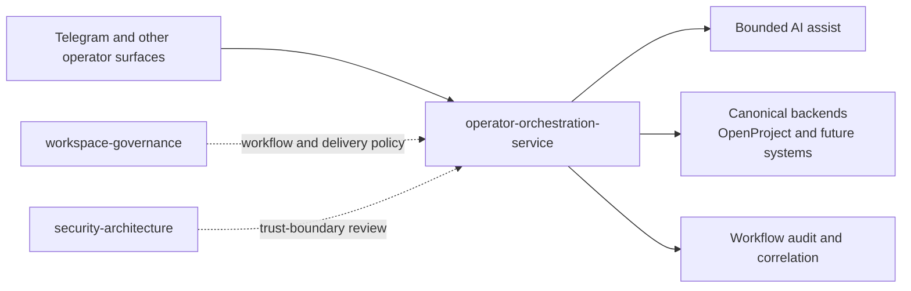

# operator-orchestration-service

`operator-orchestration-service` is a shared operator-facing workflow service that brokers bounded operator requests from fast interaction surfaces into governed, auditable workflow actions against canonical backend systems.

Current maturity:

- lifecycle: active
- workspace status: active repo and active shared component
- primary initial use case: idea capture and operator-authored idea triage from
  Telegram into OpenProject
- current implementation scope: workflow-catalog plus bounded capture, triage,
  decision, internal evaluation metadata, broker-owned proposal consumption and
  closeout, and broker-owned delivery execution reads and writes against the
  separate OpenProject delivery ART project
- local fast-iteration lanes:
  - `dev-integration` `idea-workflow` profile on local `k3s`
  - `dev-integration` `accepted-idea-delivery` profile on local `k3s`

## Architecture At A Glance



This service is the shared workflow seam between fast operator surfaces and
durable backend systems. It should stay bounded and workflow-shaped rather than
becoming a generic backend proxy.

## Repo Shape

Use the repo by path role, not by guesswork:

- `src/`
  - active runtime implementation
  - bounded workflow APIs, adapters, audit, and workflow catalog behavior
- `docs/contracts/`
  - durable API and adapter contracts
- `docs/architecture/`
  - architecture and runtime guidance
- `dev-integration/profiles/`
  - supported fast local runtime shapes for broker-owned workflow rehearsal
- `scripts/`
  - repo-local validation utilities
  - these are support tooling, not operator workflow entrypoints

If a future session finds an ad hoc helper outside those roles, treat it as
suspect until it is documented or removed.

## Intended Role

This service exists to keep workflow orchestration out of fast-changing channel
adapters such as `openclaw-telegram-enhanced/`.

The service should provide:

- stable internal workflow APIs
- workflow correlation and audit
- bounded AI-assist orchestration for operator workflows
- adapters to canonical systems such as OpenProject
- explicit operator approval before durable workflow outcomes are committed

## System Position

The intended path is:

`Telegram or another operator surface -> operator-orchestration-service -> AI assist backend and canonical backend system`

Initial target flow:

`/idea` or `/idea triage` in Telegram -> `operator-orchestration-service` ->
OpenProject write, with a reserved future AI-assisted discuss path kept behind
the broker

## What This Repo Owns

- workflow-oriented service APIs such as idea capture, triage, and decision
  recording
- correlation ids, idempotency handling, and workflow audit events
- provider-agnostic AI assist invocation for bounded operator workflows
- OpenProject-facing workflow adapters
- operator approval handling at the workflow layer

## What This Repo Does Not Own

- Telegram delivery, message formatting, or chat UX
- workspace admission contracts or intake policy
- platform rollout authority
- provider-specific governed AI policy
- canonical product or component records outside the workflows it brokers

## First Capability Boundary

The first supported workflow is expected to be:

- capture an idea from Telegram
- optionally record operator-authored triage for that idea without requiring
  desktop Codex access
- record a first bounded durable outcome as `parked`, `accepted`, or `rejected`
- record internal evaluation metadata using workspace-derived canonical tokens
  plus full free-text notes for later AI-assisted owner and scope population
- reserve bounded AI-assisted triage discussion for a later workflow step
- leave `owner-assigned` for a later explicit owner-vocabulary slice

## Security And Governance Posture

This service crosses multiple trust boundaries and must not become the trust
anchor for governance decisions.

Non-negotiable rules:

- operator approval remains required for durable intake decisions
- model output must stay bounded to a reviewed structured schema
- the service must not mutate active workspace contracts directly
- Telegram or other channel adapters must not carry backend or model-provider
  credentials

The service is active as a bounded shared workflow component now, but its live
scope is still intentionally narrow.

## Initial Repo Guide

- repo-local guidance: [AGENTS.md](AGENTS.md)
- architecture: [docs/architecture/overview.md](docs/architecture/overview.md)
- runtime shape: [docs/architecture/runtime-shape.md](docs/architecture/runtime-shape.md)
- delivery operator surface:
  [docs/operations/delivery-workflow-operator-surface.md](docs/operations/delivery-workflow-operator-surface.md)
- API reference front: [docs/api/README.md](docs/api/README.md)
- fast API contract lookup:
  `npm run api:contract -- <METHOD> <PATH>`
- live API contract probe:
  `npm run api:probe -- <METHOD> <PATH>`
- completion-evidence preflight:
  `npm run validate:completion-evidence -- <payload.json>`
- done-state narrative rule:
  completed work-item descriptions must keep the required narrative headings and
  a flat `Execution Context` that matches the stored owner, parent, delivery
  team, and iteration fields
- delivery workflow API boundary:
  [docs/architecture/delivery-workflow-api-boundary.md](docs/architecture/delivery-workflow-api-boundary.md)
- security model: [docs/architecture/security-model.md](docs/architecture/security-model.md)
- interface contract: [contracts/interface-manifest.json](contracts/interface-manifest.json)
- initial API shape: [docs/contracts/intake-api-v1.md](docs/contracts/intake-api-v1.md)
- accepted-idea delivery consumption contract:
  [docs/contracts/accepted-idea-delivery-consumption-v1.md](docs/contracts/accepted-idea-delivery-consumption-v1.md)
- delivery workflow API contract:
  [docs/contracts/delivery-workflow-api-v1.md](docs/contracts/delivery-workflow-api-v1.md)
- OpenProject adapter contract:
  [docs/contracts/openproject-adapter-v1.md](docs/contracts/openproject-adapter-v1.md)
- audit event contract: [docs/contracts/audit-events-v1.md](docs/contracts/audit-events-v1.md)
- change-record lane: [docs/records/change-records/README.md](docs/records/change-records/README.md)
- dev-integration profile:
  [dev-integration/profiles/idea-workflow/README.md](dev-integration/profiles/idea-workflow/README.md)
- accepted-idea-delivery profile:
  [dev-integration/profiles/accepted-idea-delivery/README.md](dev-integration/profiles/accepted-idea-delivery/README.md)
- runtime-admission security review:
  [`security-architecture/docs/reviews/components/2026-04-18-operator-orchestration-service-runtime-admission.md`](https://github.com/mfshaf7/security-architecture/blob/main/docs/reviews/components/2026-04-18-operator-orchestration-service-runtime-admission.md)
- component security view:
  [`security-architecture/docs/architecture/components/operator-orchestration-service/README.md`](https://github.com/mfshaf7/security-architecture/blob/main/docs/architecture/components/operator-orchestration-service/README.md)
- security review checklist:
  [`security-architecture/docs/reviews/security-review-checklist.md`](https://github.com/mfshaf7/security-architecture/blob/main/docs/reviews/security-review-checklist.md)
- AI governance standard:
  [`security-architecture/docs/standards/ai-security-and-governance.md`](https://github.com/mfshaf7/security-architecture/blob/main/docs/standards/ai-security-and-governance.md)

## Runtime Skeleton

The repo now carries a minimal no-dependency Node runtime that keeps the
service boundary real without prematurely admitting it to cluster runtime.

Implemented in the current phase:

- `GET /healthz`
- `GET /readyz`
- `GET /version`
- `GET /v1/workflows`
- `GET /v1/workflows/idea-command`
- `GET /v1/workflows/idea-capture`
- `GET /v1/workflows/idea-triage`
- `GET /v1/workflows/idea-decision`
- `GET /v1/ideas`
- `GET /v1/ideas/{idea_id}`
- `POST /v1/ideas/lookup`
- `POST /v1/ideas/capture`
- `POST /v1/ideas/{idea_id}/triage`
- `POST /v1/ideas/{idea_id}/decision`
- `POST /v1/ideas/{idea_id}/consume`
- `POST /v1/ideas/{idea_id}/closeout`
- `POST /v1/ideas/{idea_id}/evaluation`
- `GET /v1/delivery-initiatives`
- `GET /v1/delivery-initiatives/{delivery_id}/execution-summary`
- `GET /v1/delivery-initiatives/{delivery_id}/planning`
- `GET /v1/delivery-initiatives/{delivery_id}/pi-objectives`
- `GET /v1/delivery-initiatives/{delivery_id}/closeout-readiness`
- `GET /v1/delivery-work-items/{work_item_id}/continuation-context`
- `POST /v1/delivery-initiatives/{delivery_id}/governance`
- `POST /v1/delivery-initiatives/{delivery_id}/plan/apply`
- `POST /v1/delivery-initiatives/{delivery_id}/system-demo`
- `POST /v1/delivery-initiatives/{delivery_id}/inspect-and-adapt`
- `POST /v1/delivery-initiatives/{delivery_id}/pi-review`
- `POST /v1/delivery-work-items`
- `POST /v1/delivery-work-items/bulk-update`
- `POST /v1/delivery-work-items/{work_item_id}/blocker`
- `POST /v1/delivery-work-items/{work_item_id}/dependency`
- `POST /v1/delivery-work-items/{work_item_id}/parking`
- `POST /v1/delivery-work-items/{work_item_id}/update`
- `POST /v1/delivery-work-items/{work_item_id}/move`
- `POST /v1/delivery-work-items/{work_item_id}/complete`

Deferred to the next phase:

- AI-assisted `/idea triage discuss <idea-id>` suggestion path
- `owner-assigned` with an explicit owner vocabulary
- archive visibility metadata for terminal idea records only
- runtime admission and Vault-delivered secret wiring

`POST /v1/ideas/{idea_id}/evaluation` is intentionally internal metadata, not a
Telegram operator command. It exists so later AI-assisted evaluation can write
system-vocabulary owner and scope suggestions plus full notes without changing
the operator command surface first.

`POST /v1/ideas/{idea_id}/consume` is also internal-only. It promotes an
already accepted proposal into the separate OpenProject delivery ART project,
creates the delivery record if needed, and preserves durable backlinks in both
directions without adding a Telegram command surface.

Delivery execution is now broker-owned end to end. `platform-engineering`
continues to own OpenProject runtime, bootstrap, access, identity, ART repair,
and quality controls, but it is no longer the supported execution surface for
ART reads or mutations.

`POST /v1/ideas/{idea_id}/closeout` is internal-only as well. It verifies the
linked delivery record is actually `done`, then moves the source proposal to
`implemented` while keeping the proposal-to-delivery backlink intact.

`GET /v1/delivery-initiatives/{delivery_id}/execution-summary` is the first
delivery-plane read model owned directly by the broker. It returns a bounded
execution summary for one delivery initiative without exposing raw OpenProject
query semantics to callers.

`POST /v1/delivery-initiatives/{delivery_id}/governance` is the bounded
initiative governance update surface. It is initiative-only and accepts only
the delivery Epic fields that carry PM² or initiative meaning:

- `status`
- `target_pi`
- `pm2_phase`
- `sponsor`
- `business_objective`
- `success_criteria`
- `system_demo_evidence`
- `inspect_and_adapt_actions`
- `nfr_category`
- `description`

`POST /v1/delivery-initiatives/{delivery_id}/plan/apply` is the bounded plan
reconciliation surface. It reuses or updates existing child nodes by
parent/type/subject, validates readiness before publishing `ready` items, and
preserves the reconcile modes already used in live proof:

- `reconcile_missing=ignore|park`
- `reconcile_decision=retire|defer`
- `reconcile_reason`
- `reconcile_retirement_reason`
- `reconcile_review_date`

`POST /v1/delivery-work-items` is the first broker-owned delivery create
surface. It creates one child work item below an existing parent using the live
OpenProject form schema to resolve delivery fields without turning the broker
into a generic field-bag proxy.

`POST /v1/delivery-work-items/{work_item_id}/update` is the broker-owned
single-record mutation surface for ART execution work. It intentionally
accepts only bounded workflow fields:

- `status`
- `target_pi`
- `clear_target_pi`
- `assignee_login`
- `clear_assignee`
- `responsible_login`
- `clear_responsible`
- `description`
- `clear_description`
- `work_note`
- schedule and progress fields
- `owner_repo`
- execution custom fields such as team, iteration, AC/DoR/DoD, PI-objective,
  risk, and WSJF inputs

It is not a generic OpenProject patch passthrough, and it rejects `status=done`
so evidence-backed completion remains a separate workflow.

`POST /v1/delivery-work-items/bulk-update` is the broker-owned batch mutation
surface for the same bounded execution contract. It accepts one reviewable
`schema_version=1` payload with an `updates` array and applies the same broker
validation to each target work item.

`POST /v1/delivery-work-items/{work_item_id}/move` is the next bounded
structure-mutation surface. It moves one delivery work item under a new parent
inside the same initiative while keeping hierarchy validation and audit at the
broker seam. It rejects:

- cross-initiative moves
- parent loops
- unsupported parent-type relationships
- duplicate sibling placement under the new parent

`POST /v1/delivery-work-items/{work_item_id}/blocker` is the bounded blocker
workflow surface. It records or clears blocker governance on one delivery work
item without exposing raw OpenProject custom-field semantics to callers. The
route preserves the existing blocker model:

- set blocker state with required blocker narrative and decision fields
- clear blocker state only with an explicit non-`blocked` resume status
- keep blocker semantics at the broker seam instead of platform-side direct
  Rails mutation

`POST /v1/delivery-work-items/{work_item_id}/dependency` is the bounded
dependency workflow surface. It records or clears explicit predecessor
relationships between delivery work items without exposing raw OpenProject
relation semantics to callers. The route preserves the operator model:

- `target_work_item_id` depends on `depends_on_work_item_id`
- the broker creates or updates the underlying `follows` relation in the
  correct predecessor-scoped direction
- duplicate dependency rows are collapsed during `action=set`
- `action=clear` removes all matching dependency rows for the pair

`POST /v1/delivery-work-items/{work_item_id}/parking` is the bounded inactive
scope workflow surface. It parks or resumes one delivery work item without
exposing raw OpenProject custom-field or status semantics to callers. The
route preserves the current delivery model:

- `parked` means deferred work that may return later
- `retired` means terminal inactive work
- `superseded` remains a retirement reason, not a primary status
- park actions clear any active blocker fields on the same work item so
  inactive scope does not poison readiness and closeout reporting

## Local Bring-Up

1. Copy `.env.example` into local environment management.
2. Supply the OpenProject token, backlog field ids, and status ids including
   `OPENPROJECT_TRIAGED_STATUS_ID`, `OPENPROJECT_PARKED_STATUS_ID`,
   `OPENPROJECT_ACCEPTED_STATUS_ID`, `OPENPROJECT_REJECTED_STATUS_ID`, and
   `OPENPROJECT_IMPLEMENTED_STATUS_ID`.
3. If you need the accepted-idea delivery handoff locally, also supply the
   delivery project identifier plus the delivery type, status, and backlink
   field ids from the canonical OpenProject project models.
4. If the target OpenProject runtime enforces a canonical external host, also
   set `OPENPROJECT_HOST_HEADER`.
5. Start the service:

```bash
npm start
```

6. Run tests:

```bash
npm test
```

`/readyz` currently checks both config completeness and live reachability of the
configured OpenProject project. That gives the repo a concrete operator surface
before runtime admission.

## Governance Validation

```bash
python3 scripts/validate_governance_docs.py --repo-root .
python3 scripts/validate_change_record_requirement.py --repo-root . --against-ref origin/main
```

## Dev-Integration

This repo owns the first concrete `dev-integration` profile:
`idea-workflow`.

That profile exists to let the broker idea workflow iterate quickly on local
`k3s` before the winning shape moves through the governed `stage` path.

It reuses:

- this repo's real broker runtime
- `openclaw-telegram-enhanced`'s real `/idea` command handler through a local
  simulator
- `platform-engineering`'s canonical OpenProject backlog and automation runners

A second active profile, `accepted-idea-delivery`, now rehearses accepted-idea
consumption into the separate OpenProject delivery ART project on local `k3s`.
It reuses the same shared runner and local OpenProject shape, but does not
reuse the Telegram simulator because the consume path is intentionally
internal-only.

For serious delivery initiatives that already exist in `Workspace Delivery
ART`, the ART is the official work-state truth. This repo holds broker
implementation and API-contract truth, not the primary work queue.

Shared operator entrypoints are exposed from `platform-engineering`:

```bash
make devint-up PROFILE=idea-workflow
make devint-status PROFILE=idea-workflow
make devint-smoke PROFILE=idea-workflow
make devint-reset PROFILE=idea-workflow
make devint-down PROFILE=idea-workflow
make devint-promote-check PROFILE=idea-workflow
make devint-up PROFILE=accepted-idea-delivery
make devint-status PROFILE=accepted-idea-delivery
make devint-smoke PROFILE=accepted-idea-delivery
make devint-reset PROFILE=accepted-idea-delivery
make devint-down PROFILE=accepted-idea-delivery
make devint-promote-check PROFILE=accepted-idea-delivery
```

`dev-integration` does not require push or PR for ordinary iteration. It is
local-only, uses local branches or worktrees, and records the exact repo state
in a session manifest under `.dev-integration/`.

Each active profile owns an explicit governed handoff contract.
`make devint-promote-check PROFILE=<profile>` must stay aligned with the
profile README and `stage_handoff.required_checks`; source landing is not the
finish line when governed `stage` rehearsal is still part of the documented
closure path.

Once the winning shape leaves `dev-integration` and enters the PR path, follow
the workspace-level Codex review and PR procedure in
[`workspace-governance/docs/codex-github-review-and-automation.md`](https://github.com/mfshaf7/workspace-governance/blob/main/docs/codex-github-review-and-automation.md).
