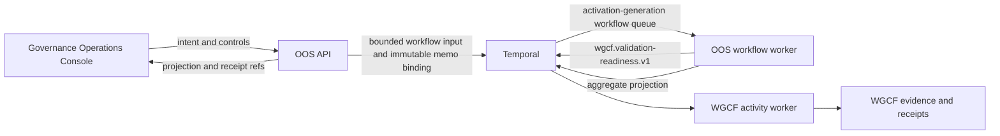

# Durable Orchestration Runtime

## Topology

## Runtime Separation

The API and workflow worker are separate image targets and workload
identities:

- `operator-orchestration-service`
- `operator-orchestration-service-worker`

The API retains its existing bounded OpenProject adapter credential. The
workflow worker receives no OpenProject credential for the validation-readiness
proof. Its only intended runtime connection is the admitted Temporal frontend.

The worker registers only:

- workflow type: `validationReadinessRunV1`
- workflow task queue:
  `oos.validation-readiness-run.v1.<activation-manifest-digest-hex>`
- workflow type: `generationStartRegistryV1`
- registry task queue:
  `oos.generation-start-registry.v1.<activation-manifest-digest-hex>`

Both queues are served continuously by separate Temporal Worker instances under
the same OOS process, connection, identity, and activation generation.

WGCF independently registers:

- activity: `wgcf.validation-readiness.evaluate`
- activity task queue: `wgcf.validation-readiness.v1`

OOS does not consume the WGCF activity queue and WGCF does not consume the OOS
workflow queues.

## Determinism

Workflow-bundled modules contain no Node filesystem, crypto, network, process,
or clock API. Request hashing and rich request validation happen on the API
side before the bounded input crosses into Temporal. Workflow time comes from
the Temporal workflow runtime. The recorded Temporal workflow start time is the
approval handoff boundary. An approval that expires before that event produces
a terminal no-effect projection and receipt without dispatching an activity.

The bounded history input retains caller, operator, and approval identifiers,
the verified activation-evidence digest, and its derived workflow queue for
audit correlation. It does not retain caller credentials, intent prose, or raw
approval content.

The API also records a bounded immutable binding in Temporal memo. That binding
contains references and digests only, including the activation-evidence
digest, and lets the API verify a duplicate start through Temporal `describe`,
which is server-readable before a workflow worker registers its query handler.
A new start therefore returns its stable run id as soon as Temporal accepts it.
Aggregate state remains a separate workflow-owned projection read through the
run resource.

CI builds the deterministic workflow bundle and both image targets. It also
proves the worker reports `run_allowed: false` without activation evidence.

## Persistence And Projection

Temporal persists workflow execution state. It is not the business source of
truth. The source record remains in its authority system, WGCF retains its
validation evidence, and OOS owns the aggregate operator projection.

Normal runtime suspension must preserve Temporal persistence and OOS run
identity. Destructive reset, backup, restore, and replay proof remain
Platform-owned activation evidence.

OOS consumes that evidence as one Platform-issued, read-only activation bundle
with a digest-pinned manifest. It validates the exact definition and profile
lifecycle, admitted Temporal address and namespace, role-bound API and
workflow-worker identities, decision freshness, and every fixed record's
digest, gate, owner, accepted outcome, immutable source version, and authority
reference before either the API or worker can run. Independent Temporal
environment values cannot redirect an accepted bundle to another target.
Individual environment reference strings cannot satisfy admission.

The API and workflow-worker identities are distinct and cannot be exchanged.
Retained run reads may outlive time-sensitive gate acceptance, but they still
require the digest-pinned address, namespace, API identity, and every authority
record to verify before the API constructs a Temporal client.

The API independently requires an authenticated, allowlisted Governance
Operations Console caller. The worker never receives that API caller secret.
The API caches a successful Temporal client but clears a rejected client
promise, allowing a later request to reconnect after transient transport or
startup failure. The worker revalidates the mounted evidence bundle and runtime
switches every 30 seconds. New starts and normal reads require the complete
authority-record set. Evidence loss or a generation change makes the ordinary
worker stop polling immediately and report an incomplete fence; it does not
keep running to perform cleanup, and denied startup never revives the old queue.

Clean generation retirement is an explicit Platform/OOS handoff. Platform
first quiesces API start ingress and proves zero active ingress replicas and
zero in-flight starts. It then scales ordinary workflow pollers to zero and
proves that state before issuing a short-lived retirement manifest. The
manifest is digest-pinned to the old activation manifest, generated queues,
Temporal target, both Platform drain evidence refs, the digest-derived
generation start registry, and the OOS receipt verifier key. Every admitted
business start first records its workflow ID through Update-with-Start in that
durable registry. The registry admits at most 512 workflow IDs per generation,
requires a workflow-validated deterministic Update ID for each workflow ID,
and neither a duplicate retry nor a rejected Update grows accepted history.
Capacity rejection is a named broker conflict that directs the operator to
retire the full generation before activating a fresh one.
OOS verifies its Ed25519
receipt key before mutation, carries the manifest lifetime in the seal signal,
and validates handler time before sealing after ingress is drained. An expired
signal leaves the registry open for a fresh authorized seal instead of closing
it irreversibly.
reconciles only those exact workflow IDs, stages admitted cancel
signals before polling, and starts a one-shot worker only on the retired queue.
It verifies a terminal projection for every committed registration and records
uncommitted registrations separately. Temporal Visibility remains diagnostic
and is not retirement authority. Platform must accept the resulting receipt
before issuing a fresh activation, whose new manifest digest derives different
business and registry queues. The receipt binds the registry seal to the exact
retirement authorization, carries an OOS Ed25519 attestation, and binds the
one-shot worker start to the current manifest lifetime separately from its later
completion time. The manifest pins the versioned canonical JSON byte encoding,
signed-content boundary, verifier key ID, and public-key digest; both repos
prove those bytes against the same published conformance vector. An expired
post-seal attempt can resume only through a fresh
manifest that names the exact prior seal authorization and lifetime. Both
drained-state observations must still be no more than five minutes old at the
one-shot start boundary. A retired digest is never reused.

Activity cancellation uses Temporal's wait-for-cancellation-completion policy.
The paired WGCF adapter heartbeats every two seconds for cancellation delivery
and runs synchronous validation in an isolated process group with a four-minute
budget that begins before process spawn, five-second termination grace,
five-second process-group exit confirmation, and one-second bounded
communication drain. OOS deliberately configures no heartbeat timeout: loss of
heartbeat proves neither cancellation nor owner termination. WGCF keeps each
attempt's output in a staging root and grants canonical local-evidence authority
through an idempotent atomic commit only after group exit is confirmed. Artifact
references are bound to the future committed root before the staged tree moves,
and cancellation is propagated only after the bounded stop-and-confirm fence
returns. Failed, cancelled, timed-out, or unfenced attempts remain quarantined
or otherwise non-canonical. The five-minute start-to-close timeout therefore
prevents Temporal from releasing an automatic retry while the prior attempt can
write canonical evidence, without claiming that the operating system can
physically terminate every kernel-stuck process. Control responses are
reconciled against retained workflow history.
Success requires every immutable control field to match. A close race returns a
bounded not-applied conflict; a reused control id or idempotency key with
different immutable fields returns a separate idempotency conflict.

## Network And Identity Boundary

The target worker identity is:

- service account: `temporal-oos-worker`
- pod label: `orchestration.workspace/identity=oos-workflow-worker`

The worker must not be scaled above zero until Platform has admitted its
namespace-to-frontend network path and Security has accepted the operating
identity, payload, retention, and restart evidence.

Platform runtime acceptance must also update the Temporal payload allowlist to
the exact bounded input and immutable memo binding implemented here. The
current build-admitted runtime contract does not yet admit `schema_version`,
`request_ref`, source-projection refs, `caller_id`, or the memo binding; that
mismatch keeps execution denied.

## Rollback

Runtime rollback is:

1. quiesce OOS start ingress and prove no start remains in flight
2. scale ordinary OOS workflow pollers to zero and prove that state
3. issue the Platform retirement manifest for the old digest-derived queue
4. run the one-shot OOS retirement worker and retain its receipt
5. preserve Temporal persistence and evidence
6. classify the failure as API contract, definition, runtime, activity,
   identity, or projection
7. resume only through a newly accepted source and fresh activation posture

Deleting workflow history is not rollback.
