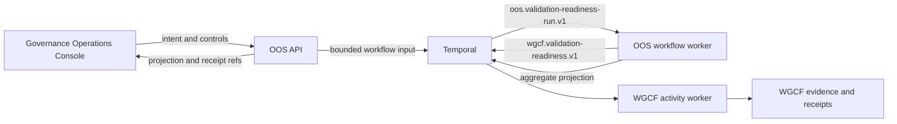

# Durable Orchestration Runtime

## Topology

## Runtime Separation

The API and workflow worker are separate image targets and workload
identities:

- `operator-orchestration-service`
- `operator-orchestration-service-worker`

The API retains its existing bounded OpenProject adapter credential. The
workflow worker receives no OpenProject credential for the validation-readiness
proof. Its only intended runtime connection is the admitted Temporal frontend.

The worker registers only:

- workflow type: `validationReadinessRunV1`
- workflow task queue: `oos.validation-readiness-run.v1`

WGCF independently registers:

- activity: `wgcf.validation-readiness.evaluate`
- activity task queue: `wgcf.validation-readiness.v1`

OOS does not consume the WGCF activity queue and WGCF does not consume the OOS
workflow queue.

## Determinism

Workflow-bundled modules contain no Node filesystem, crypto, network, process,
or clock API. Request hashing and rich request validation happen on the API
side before the bounded input crosses into Temporal. Workflow time comes from
the Temporal workflow runtime. The recorded Temporal workflow start time is the
approval handoff boundary. An approval that expires before that event produces
a terminal no-effect projection and receipt without dispatching an activity.

The bounded history input retains caller, operator, and approval identifiers
for audit correlation. It does not retain caller credentials, intent prose, or
raw approval content.

CI builds the deterministic workflow bundle and both image targets. It also
proves the worker reports `run_allowed: false` without activation evidence.

## Persistence And Projection

Temporal persists workflow execution state. It is not the business source of
truth. The source record remains in its authority system, WGCF retains its
validation evidence, and OOS owns the aggregate operator projection.

Normal runtime suspension must preserve Temporal persistence and OOS run
identity. Destructive reset, backup, restore, and replay proof remain
Platform-owned activation evidence.

OOS consumes that evidence as one Platform-issued, read-only activation bundle
with a digest-pinned manifest. It validates the exact definition and profile
lifecycle, admitted Temporal address and namespace, role-bound API and
workflow-worker identities, decision freshness, and every fixed record's
digest, gate, owner, accepted outcome, immutable source version, and authority
reference before either the API or worker can run. Independent Temporal
environment values cannot redirect an accepted bundle to another target.
Individual environment reference strings cannot satisfy admission.

The API and workflow-worker identities are distinct and cannot be exchanged.
Retained run reads may outlive time-sensitive gate acceptance, but they still
require the digest-pinned address, namespace, API identity, and every authority
record to verify before the API constructs a Temporal client.

The API independently requires an authenticated, allowlisted Governance
Operations Console caller. The worker never receives that API caller secret.
Instead, it revalidates the mounted evidence bundle and runtime switches every
30 seconds. New starts and normal reads require the complete authority-record
set. Lifecycle cancellation requires the digest-pinned manifest itself to keep
binding the exact Temporal address, namespace, workflow-worker identity,
definition, profile, and ordered lifetime, but deliberately does not require
the revoked authority-record files to remain valid. When those records expire,
change, disappear, or otherwise stop resolving to an accepted posture, the
worker can therefore deny execution and still send the admitted cancel control
to every running execution on the pinned target. Workflow polling remains
available for the drain. Each workflow cancels outstanding activities and
retries, records its terminal projection and aggregate receipt, and closes
before the worker exits. Fencing uses a separate Temporal client connection and
retries until the terminal results are verified. Seven consecutive empty
visibility scans over 30 seconds close the admitted-start and visibility-lag
race; any execution, RPC error, or invalid terminal projection resets
confirmation. Denied startup first stages cancel signals across the same stable
visibility window, then runs a workflow-only drain and verifies every observed
terminal result before returning activation denial. If the pinned manifest,
target, or role-specific identity cannot be verified, denied startup refuses to
connect or fence that target.

Activity cancellation uses Temporal's wait-for-cancellation-completion policy.
OOS requires a ten-second heartbeat timeout within the five-minute
start-to-close window. The paired WGCF adapter heartbeats every two seconds and
runs synchronous validation in an isolated process group with a four-minute
owner limit. Cancellation or owner timeout terminates that group before WGCF
acknowledges the outcome. Together, those controls prevent OOS from recording a
terminal cancelled or timed-out aggregate while owner work can still mutate
evidence. Control responses are reconciled against retained workflow history.
Success requires every immutable control field to match. A close race returns a
bounded not-applied conflict; a reused control id or idempotency key with
different immutable fields returns a separate idempotency conflict.

## Network And Identity Boundary

The target worker identity is:

- service account: `temporal-oos-worker`
- pod label: `orchestration.workspace/identity=oos-workflow-worker`

The worker must not be scaled above zero until Platform has admitted its
namespace-to-frontend network path and Security has accepted the operating
identity, payload, retention, and restart evidence.

Platform runtime acceptance must also update the Temporal payload allowlist to
the exact bounded input implemented here. The current build-admitted runtime
contract does not yet admit `schema_version`, `request_ref`, source-projection
refs, or `caller_id`; that mismatch keeps execution denied.

## Rollback

Runtime rollback is:

1. deny new starts in OOS
2. signal the admitted cancel control to every running definition execution
3. keep workflow polling available while runs record terminal projections and
   aggregate receipts
4. verify the terminal drain, then scale the OOS workflow worker to zero
5. preserve Temporal persistence and evidence
6. classify the failure as API contract, definition, runtime, activity,
   identity, or projection
7. resume only through a newly accepted source and activation posture

Deleting workflow history is not rollback.
