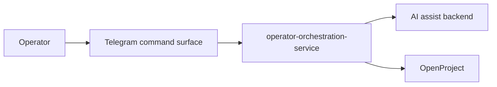

# Architecture Overview

## Purpose

`operator-orchestration-service` is the proposed durable middle layer between
fast operator-facing command surfaces and the canonical systems that store or
execute approved workflow outcomes.

## Initial System Shape

## Why This Service Exists

Directly binding Telegram command logic to workflow orchestration would make the
workflow fragile because:

- Telegram UX changes quickly
- backend systems such as OpenProject evolve independently
- model providers may change over time

This service isolates those seams behind a stable workflow API.

## Trust Boundaries

The service sits across these boundaries:

- human operator boundary
- AI suggestion boundary
- backend system-of-record boundary

The service must preserve these controls:

- operator approval for durable outcomes
- bounded, structured model output
- audit of capture, suggestion, and decision events
- no direct mutation of active workspace contracts

## Initial Capability Set

Phase 1 should stay narrow:

- capture idea
- request idea triage
- record operator decision
- write accepted result into OpenProject

## Non-Goals

Phase 1 is not:

- a general agent runtime
- a general operator chatbot
- a platform rollout controller
- a replacement for OpenProject

## Integration Boundaries

- `openclaw-telegram-enhanced`
  - owns command UX and Telegram rendering
- `operator-orchestration-service`
  - owns workflow orchestration and backend coordination
- `workspace-governance`
  - owns intake schema and governance meaning
- `security-architecture`
  - owns AI governance and trust-boundary review
- `platform-engineering`
  - will own governed invocation path only when that path becomes a real shared
    platform control
