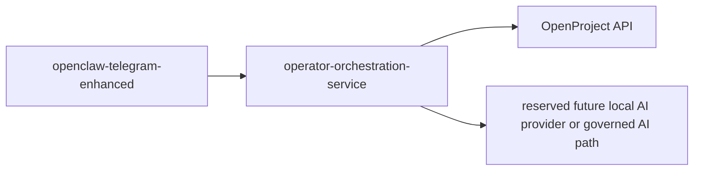

# Runtime Shape

## Initial Synchronous Decision

The initial broker remains a small internal HTTP service and not a general
agent runtime.

## Intended Deployment Position

The intended runtime shape is:

- cluster-internal service
- no public ingress
- callable only by approved internal operator surfaces
- separate from `openclaw-telegram-enhanced`

Initial caller:

- `openclaw-telegram-enhanced`

Initial backend systems:

- OpenProject
- reserved future local AI assist provider or governed AI path

## Why This Shape

This keeps the workflow seam stable while:

- Telegram UX changes
- OpenProject configuration evolves
- AI provider strategy changes over time

## Phase 1 Topology

## Endpoint Style

Phase 1 endpoints stay synchronous HTTP:

- `GET /v1/workflows`
- `GET /v1/workflows/idea-command`
- `GET /v1/workflows/idea-capture`
- `GET /v1/workflows/idea-triage`
- `GET /v1/workflows/idea-decision`
- `GET /v1/ideas`
- `GET /v1/ideas/{idea_id}`
- `GET /v1/delivery-initiatives/{delivery_id}/execution-summary`
- `POST /v1/delivery-initiatives/{delivery_id}/governance`
- `POST /v1/delivery-initiatives/{delivery_id}/plan/apply`
- `POST /v1/delivery-work-items/{work_item_id}/blocker`
- `POST /v1/delivery-work-items/{work_item_id}/dependency`
- `POST /v1/delivery-work-items/{work_item_id}/parking`
- `POST /v1/delivery-work-items/{work_item_id}/move`
- `POST /v1/delivery-work-items/{work_item_id}/update`
- `POST /v1/ideas/lookup`
- `POST /v1/ideas/capture`
- `POST /v1/ideas/{idea_id}/triage`
- `POST /v1/ideas/{idea_id}/decision`
- `POST /v1/ideas/{idea_id}/consume`

Reason:

- operator workflows are low-volume
- the first use case is interactive
- the phone-friendly triage path should remain usable without AI availability
- the accepted-idea delivery handoff is still an internal broker action even
  after implementation
- the first delivery execution read surface is still low-volume and internal
- the first delivery execution command surface is still low-volume and internal
- synchronous responses simplify Telegram rendering and operator approval

## Data And State Shape

Phase 1 should not introduce a dedicated internal database unless forced by a
real requirement.

The intended state model is:

- OpenProject remains the canonical idea record
- the broker owns transient workflow logic
- the broker owns workflow descriptors and normalized read projections
- correlation ids and source refs are carried through the workflow
- audit is emitted as structured events

If durable broker-side state later becomes necessary for retries or multi-step
workflow recovery, that should be introduced deliberately and documented as a
new trust-boundary decision.

## Idempotency Direction

Phase 1 should require callers to send a stable source reference and/or
idempotency key.

The broker should:

- treat source refs as first-class workflow correlation keys
- avoid duplicate idea creation when the same source ref is replayed
- preserve returned canonical record refs for reuse by later steps

The exact deduplication mechanism is deferred until the OpenProject field model
is finalized.

## Health And Visibility Expectations

Before admission to active runtime, the service must answer:

- health endpoint
- version or commit attestation
- structured audit output location
- caller auth status and backend reachability diagnostics

Expected minimum operator surfaces:

- `/healthz`
- `/readyz`
- `/version`

## Durable Extension

OOS now also contains a source-admitted, execution-disabled durable
orchestration adapter for workflows that require restart survival, bounded
retry, or persisted waits.

This does not turn ordinary broker routes into background jobs. Durable
execution is definition-specific, uses a separate worker image and identity,
and remains behind Platform and Security activation gates.

Read:

- [durable-orchestration-runtime.md](durable-orchestration-runtime.md)
- [../contracts/durable-orchestration-v1.md](../contracts/durable-orchestration-v1.md)
- [../operations/durable-orchestration-operator-surface.md](../operations/durable-orchestration-operator-surface.md)

## Still Deferred

- public ingress
- webhook fan-out
- arbitrary background job orchestration outside admitted definitions
- generic chat completions
